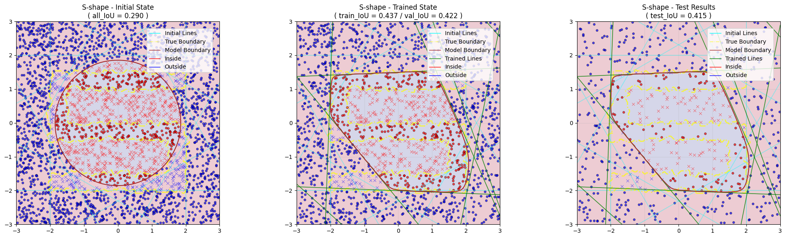

# Neural Network-Based Convex Shape Classification

[](https://www.python.org/)
[](https://tensorflow.org/)
[](LICENSE.md)

_A geometric approach to binary shape classification with custom activation functions and polygon boundary approximation._


## 🎯 Overview

This project demonstrates how to approximate convex polygons using neural networks where:
- **ReLU neurons represent half-plane constraints**
- **Multiplication implements logical AND operations** 
- **Geometric weight initialization** speeds up convergence
- **IoU (Intersection over Union)** provides accurate shape-specific performance metrics

### Key Features

- 🔧 **Custom Activation Functions**: Implement AND logic through multiplication operations
- 📐 **Geometric Interpretability**: Each neuron represents a mathematically meaningful half-plane
- 🎨 **Interactive Visualizations**: See decision boundaries, training progress, and model weights
- 📊 **Comprehensive Analysis**: IoU-based evaluation with performance comparisons
- 🔄 **Multiple Shape Support**: Circles, ellipses, triangles, polygons, and complex shapes

## 🖼️ Example Results

### Convex Shapes (Excellent Performance)

| Circle | Ellipse | Triangle |
|--------|---------|----------|
|  |  |  |

| House Shape | Diamond | Pentagon |
|-------------|---------|----------|
|  |  |  |

### Non-Convex Shapes (Shows Method Limitations)

| L-Shape | S-Shape |
|---------|---------|
|  |  |

> **Note**: The multiply-all approach works best with **convex** shapes. Non-convex shapes demonstrate the mathematical limitations of intersecting half-planes.

## 🚀 Quick Start

### Prerequisites

- Python 3.8+
- TensorFlow 2.x
- NumPy, Matplotlib, Scikit-learn, SciPy

### Installation

1. Clone the repository:
```bash
git clone https://github.com/Dani-Luk/kaggle-wrapping-convex-shape-classifier.git
cd kaggle-wrapping-convex-shape-classifier
```

2. Install dependencies:
```bash
pip install -r requirements.txt
```

3. Launch Jupyter notebook:

**Option A: Using python -m (Recommended for Windows)**
```bash
python -m notebook NN-wrapping-shape-classifier.ipynb
```

**Option B: Using jupyter command (if available)**
```bash
jupyter notebook NN-wrapping-shape-classifier.ipynb
```

**Option C: Using VS Code (Alternative)**
- Open `NN-wrapping-shape-classifier.ipynb` directly in VS Code
- VS Code will automatically detect and run the notebook

### Basic Usage

```python
# Run a complete shape classification experiment
results = run_model(
    shape_type='circle',           # 'circle', 'triangle', 'polygon', etc.
    n_sides=8,                     # Number of polygon sides (hyperplanes)
    random_seed=42,                # For reproducibility
    radius_x=1.0, radius_y=1.0,    # Shape parameters
    corners=None                   # List of vertices in counter-clockwise order
)

print(f"Validation IoU: {results['iou']:.4f}")
```

## 📚 Mathematical Foundation

### Core Concept

The model approximates convex polygons using the mathematical principle: 

$$\text{polygon-interior} = \prod_i \text{ReLU}(w_{i1} x + w_{i2} y + b_i)$$

Where:
- Each ReLU neuron represents a **half-plane constraint**: $\text{ReLU}(w_1 x + w_2 y + b) = \max(0, w_1 x + w_2 y + b)$
- **Multiplication implements AND logic**: All constraints must be satisfied simultaneously
- The intersection of half-planes forms a **convex polygon**

### Why This Approach?

1. **Geometric Interpretability**: Each weight has clear geometric meaning
2. **Convex Guarantee**: Mathematical properties ensure convex approximations
3. **Efficient Learning**: Geometric initialization provides good starting points
4. **Visual Understanding**: Decision boundaries are directly interpretable

## 🛠️ Architecture Details

### Model Structure
```
Input(2D) → Dense(n_sides, ReLU) → Custom_Activation → Dense(1, Sigmoid) → Output
```

### Custom Activation Functions

- **`multiply_and_activation`**: Direct multiplication with custom gradients
- **`log_multiply_and_activation`**: Log-space arithmetic for numerical stability

### Training Strategy

1. **Phase 1**: Train output layer only (frozen polygon layer)
2. **Phase 2**: Train all layers with geometric initialization
3. **Evaluation**: IoU-based performance measurement (Intersection over Union)

## 📊 Performance Analysis

### IoU(Intersection over Union) Results Summary

| Shape Type | Avg IoU | Performance |
|------------|---------|-------------|
| Convex Shapes | >0.95 | Excellent |
| Simple Polygons | >0.80 | Good |
| Non-Convex Shapes | ~0.5 | Limited* |

*Limited performance on non-convex shapes is expected due to mathematical constraints

## 🔬 Experimental Setup

### Supported Shapes

- **Circles & Ellipses**: Perfect for demonstrating polygon approximation
- **Triangles**: Equilateral, custom, and irregular triangles
- **Regular Polygons**: Pentagon, hexagon, etc.
- **Custom Polygons**: House shapes, diamonds, stars
- **Non-Convex**: L-shapes, S-shapes (demonstrates limitations)

### Hyperparameters

- **n_sides**: Number of polygon sides (typically 6-12)
- **random_seed**: For reproducible experiments
- **n_samples**: Training data size (default: 3000)
- **activation_fn**: Choice between multiplication variants

## 📝 Project Highlights

- Custom activation function based on a multiply-all (logical AND) operation  
- Circle-based weight initialization strategy  
- IoU-based evaluation for shape-specific performance  
- Geometry-inspired architecture for interpretability  

## 🔮 Future Work

- Extending to 3D shapes and higher-dimensional convex sets  
- Dynamic neuron allocation for misclassified regions  

## 🤝 Contributing

Contributions are welcome:
- Bug reports and feature requests  
- Documentation improvements  
- New shape types or experiments  
- Training optimizations  

## 📄 License

This project is licensed under the MIT License - see the [LICENSE](LICENSE.md) file for details.

## 🙏 Acknowledgments

- Inspired by geometric deep learning principles
- TensorFlow team for custom gradient support
- Matplotlib for visualization capabilities

---
_If you find this project useful, feedback and contributions are welcome._

